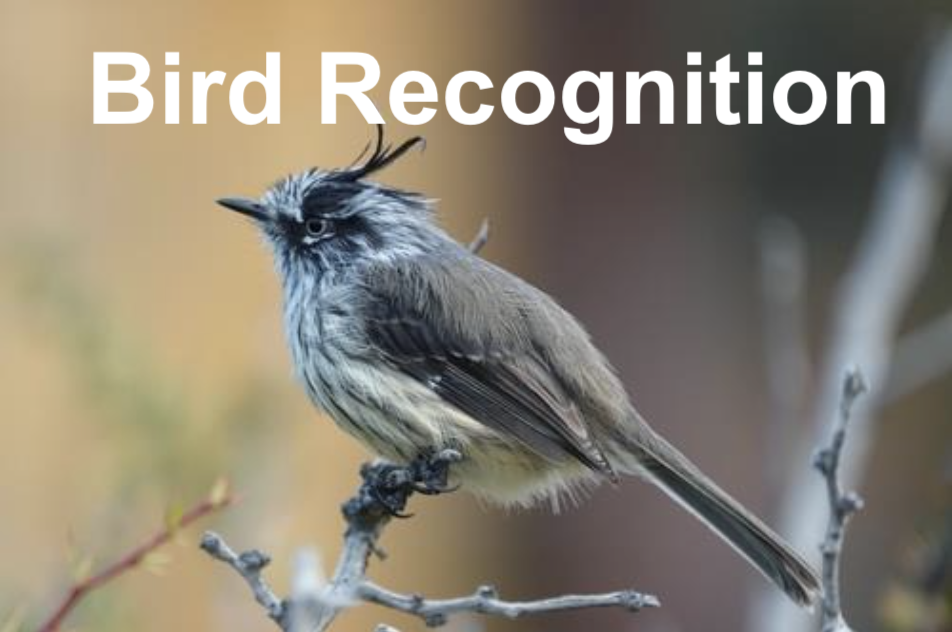
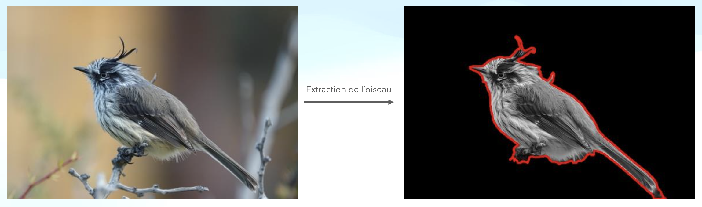

<h3 align="center">Bird Recognition</h3>

<!-- ABOUT THE PROJECT -->
## About The Project

[](res/home-bird.png)

Bird Recognition is a Machine Learning project, built to work on a RaspberryPi with a camera placed in a birdhouse.
The program take continuous photos to classify the different birds coming in the birdhouse.

<p align="right">(<a href="#readme-top">back to top</a>)</p>

### Built With

* [![Python][Python.com]][Python-url]
* [![Numpy][Numpy.com]][Numpy-url]

<p align="right">(<a href="#readme-top">back to top</a>)</p>

<!-- GETTING STARTED -->
## Getting Started

### Compilation
1. From project root,
2. Launch ```./program.sh``` this script will :
    *   **install all necessary dependencies** to launch the project
    *   launch **unit tests**
    *   launch **main.py** to run the program which will **classify birds** in the correct folders
    
### Reinitialize image disposition to re-run the tests:
1. From project root,
2. Launch ```./program.sh``` this script will :
    *   put every **image** from each **subfolder** of ```/resources/results/``` into the **initial folder** ```/resources/extracted_birds_to_validate/```
    *   delete the **subfolders created in the folder** ```/resources/results/```

<p align="right">(<a href="#readme-top">back to top</a>)</p>

<!-- USAGE EXAMPLES -->
## Usage

[](res/usage-screenshot.png)

<!-- CONTACT -->
## Contact

Reda Meziane - reda.meziane99@gmail.com

Project Link: [https://github.com/BirdRecognition](https://github.com/RedaMez/Bird-Recognition)

<p align="right">(<a href="#readme-top">back to top</a>)</p>

<!-- MARKDOWN LINKS & IMAGES -->
<!-- https://www.markdownguide.org/basic-syntax/#reference-style-links -->
[Numpy.com]: https://img.shields.io/badge/numpy-013243?style=for-the-badge&logo=numpy&logoColor=white
[Numpy-url]: https://numpy.org
[Python.com]: https://img.shields.io/badge/Python-3776AB?style=for-the-badge&logo=python&logoColor=white
[Python-url]: https://python.org

